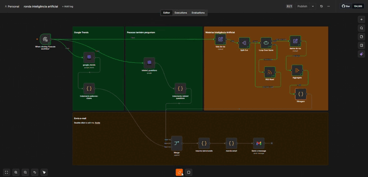
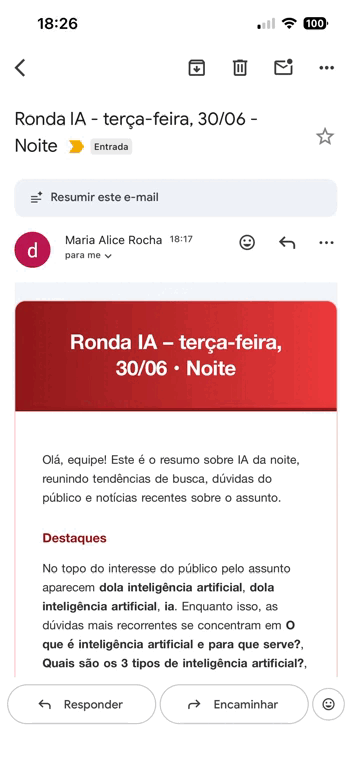
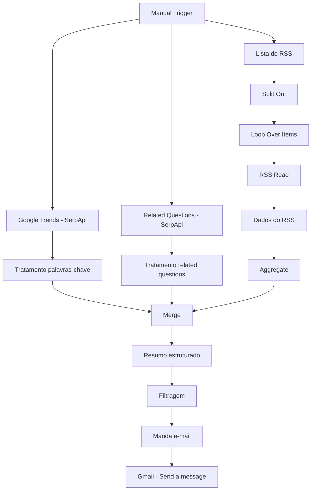

# Ronda IA - Monitoramento Automatizado de Pauta

Pipeline de automação construído em **n8n** que monitora diariamente o interesse público e a cobertura jornalística em torno do tema "Inteligência Artificial" no Brasil, consolidando tudo em um resumo executivo enviado por e-mail.

## Problema

O monitoramento manual de buscas, notícias e menções sobre um tema específico é uma atividade recorrente e de baixa escalabilidade. Esse processo consome tempo que poderia ser destinado a análises estratégicas ou, quando não realizado de forma sistemática, pode resultar na perda de tendências e oportunidades relevantes.

## Solução

Um workflow que roda sob demanda (ou agendado) e:

1. Consulta o **Google Trends** (via SerpApi) para identificar termos de busca em alta relacionados a "inteligência artificial" na última hora
2. Busca as **perguntas mais frequentes do público** sobre o tema (People Also Ask)
3. Lê feeds **RSS** de veículos de notícia (G1, CNN Brasil, entre outros) filtrando matérias relevantes ao tema
4. Agrega, limpa e filtra os três conjuntos de dados
5. Monta um **resumo estruturado em HTML** com os destaques do período
6. Envia o resumo por **e-mail** via Gmail

## Resultado

## Arquitetura

## Decisões técnicas

- **n8n em vez de Airflow** para este caso: o workflow é leve, orientado a uma execução pontual/agendada simples, e se beneficia da integração nativa com Gmail/RSS/APIs via nós prontos, não justifica a complexidade de DAGs do Airflow, que reservo para pipelines batch mais robustos ([veja meu projeto com Airflow](https://github.com/marialicer/macro-pipeline)).
- **Nós de Code (JavaScript) em vez de nó de IA generativa** para montar o resumo: a lógica de seleção dos top termos/perguntas/notícias é determinística (regras de negócio claras), então optei por não introduzir uma chamada de LLM onde não havia ambiguidade a resolver. Isso reduz custo, latência e pontos de falha.
- **Merge antes do resumo**: os três ramos (trends, perguntas, notícias) rodam em paralelo e só se sincronizam no nó Merge, evitando que uma chamada de API mais lenta bloqueie as outras.
- **Trava de segurança no nó de resumo** (`if ($runIndex > 0) return []`): evita reprocessamento duplicado em re-execuções dentro do mesmo loop.

## Como rodar

1. Importe o arquivo `ronda_inteligencia_artificial.json` no seu n8n
2. Configure as credenciais:
   - **SerpApi** (Google Trends + Related Questions) - [serpapi.com](https://serpapi.com)
   - **Gmail OAuth2** (envio do resumo)
3. Ajuste o e-mail de destino no nó `Send a message`
4. Execute manualmente ou configure um Schedule Trigger no lugar do Manual Trigger

## Stack

`n8n` · `SerpApi (Google Trends API)` · `RSS` · `Gmail API` · `JavaScript`

---

## Autora
Maria Alice Rocha  
Data Analyst, especialista em Analytics e BI pela PUC Minas 
[Github](https://github.com/marialicer)·[Portfólio](https://marialicer.github.io)